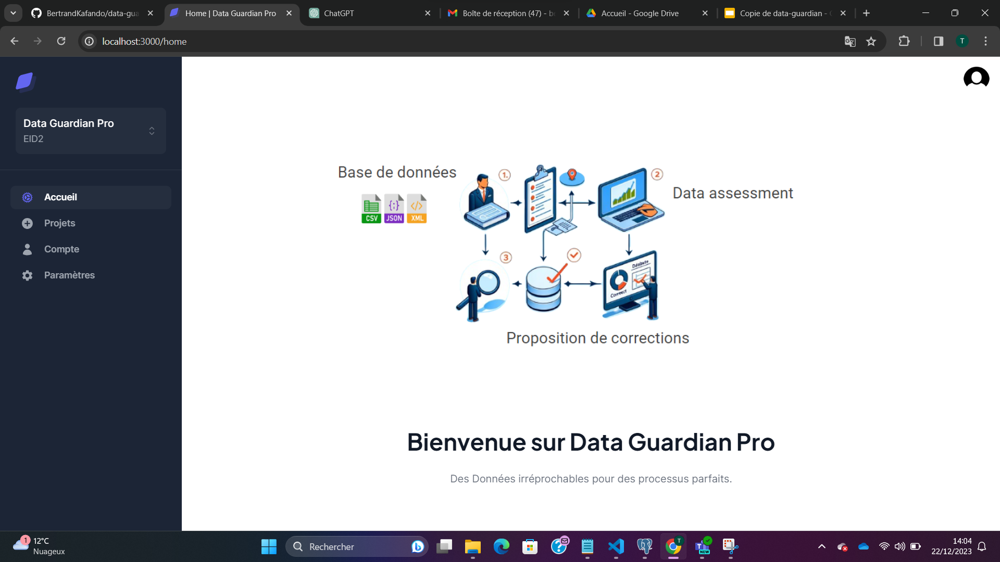

# Readme

# DataGuardian

## Overview
<p align="center">

</p>

[👉  Have a look of Frontend ](https://github.com/BertrandKafando/data-guardian-client)


## Project details to know

The ```settings``` folder is divided into modules for better configuration management. Here are the available modules:

- `base.py`: Contains the base configurations of the project and is inherited by other modules.
- `dev.py`: Contains the database configurations for the development environment.
- `prod.py`: Contains the database configurations for the production server.

The module to use is selected based on the value of the `ENV_MODE` environment variable defined in the `settings/__init__.py` file. Make sure to set this variable correctly in your .env file according to your deployment environment.


### .env File

The `.env` file located in the settings folder contains all the global variables required for proper project configuration. Make sure to fill it correctly based on the `.env.example` file in the same directory.

## TODO : describe all variables of .env here

## Installation and Configuration on Docker

### Prerequisites

Before getting started, make sure you have the following installed on your machine:

- Docker
- Docker Compose
- Python 3.9

We use Docker & Docker compose to deploy the project.
Make sure you have the latest versions of docker and docker-compose installed on the target machine!

### Steps

1. Clone the GitHub repository:

    ```git clone <REPOSITORY_URL>```

2. Navigate to the project directory:

    ```cd DataGuardian```

3. Create a ```.env``` file in the ```DataGuardian/DataGuardian/settings``` directory based on the ```.env.example``` file. 
This file contains the global variables required for project configuration. Make sure to fill in the correct values.


4. Build and run the Docker containers using Docker Compose:

    ```docker-compose up -d```

5. Check the logs to ensure everything is running correctly: 

    ```docker-compose logs```

6. The server should be listening on port 8001.


### Local Configuration and Execution

If you want to run the project locally without Docker, follow these additional steps:

1. Ensure you have a running Postgres server running (use **psql** command to connect ):

    ```CREATE USER <USERNAME> WITH PASSWORD ‘PASSWORD’;```
    ```CREATE DATABASE <DB_NAME>;```
    ```GRANT ALL PRIVILEGES ON DATABASE <DB_NAME> TO <USERNAME>;```

> MAC

2. Create a Python virtual environment and activate it:

    ```
    python3.9 -m venv env
    source env/bin/activate
    ```

3. Install the dependencies:

    ```pip install -r requirements.txt```


4. Perform the database migrations:

    ```
    python3 DataGuardian/manage.py makemigrations
    python3 DataGuardian/manage.py migrate
    ```

5. Start the development server:

    ```python3 DataGuardian/manage.py runserver```


    > WINDOWs

2. Create a Python virtual environment and activate it:

    ```
    python -m venv env
    env/Scripts/activate
    ```

3. Install the dependencies:

    ```pip install -r requirements.txt```


4. Perform the database migrations:

    ```
    python DataGuardian/manage.py makemigrations
    python DataGuardian/manage.py migrate
    ```

5. Start the development server:

    ```python DataGuardian/manage.py runserver```


The server should be accessible at http://localhost:8000.
